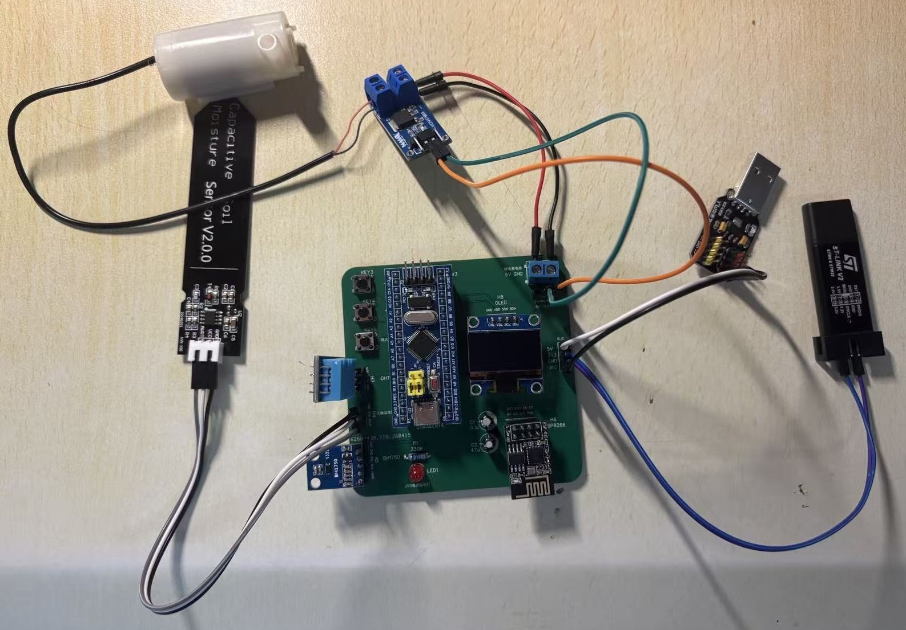
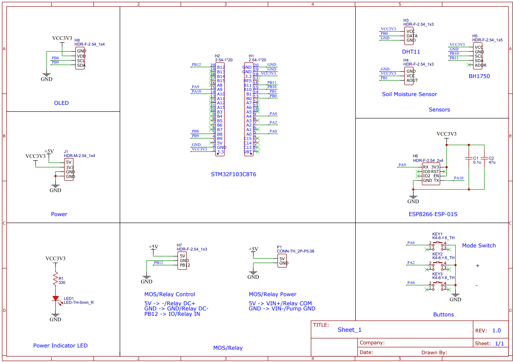
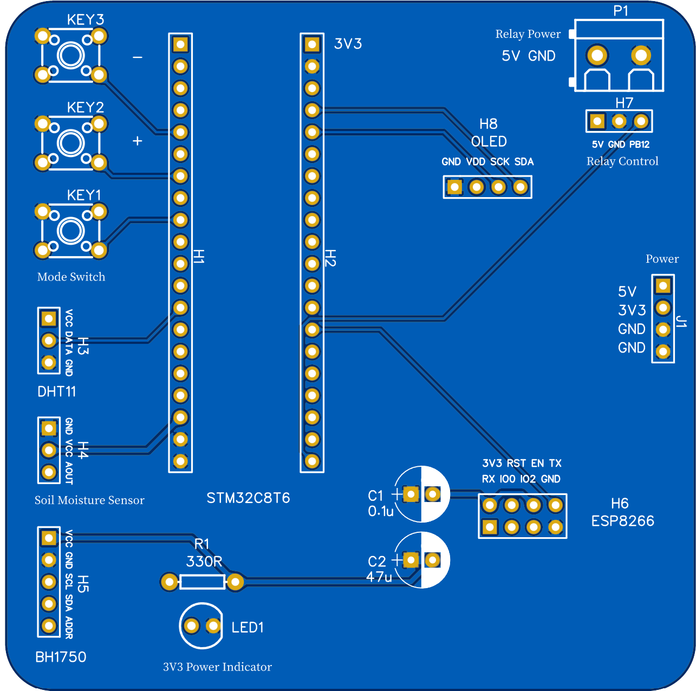
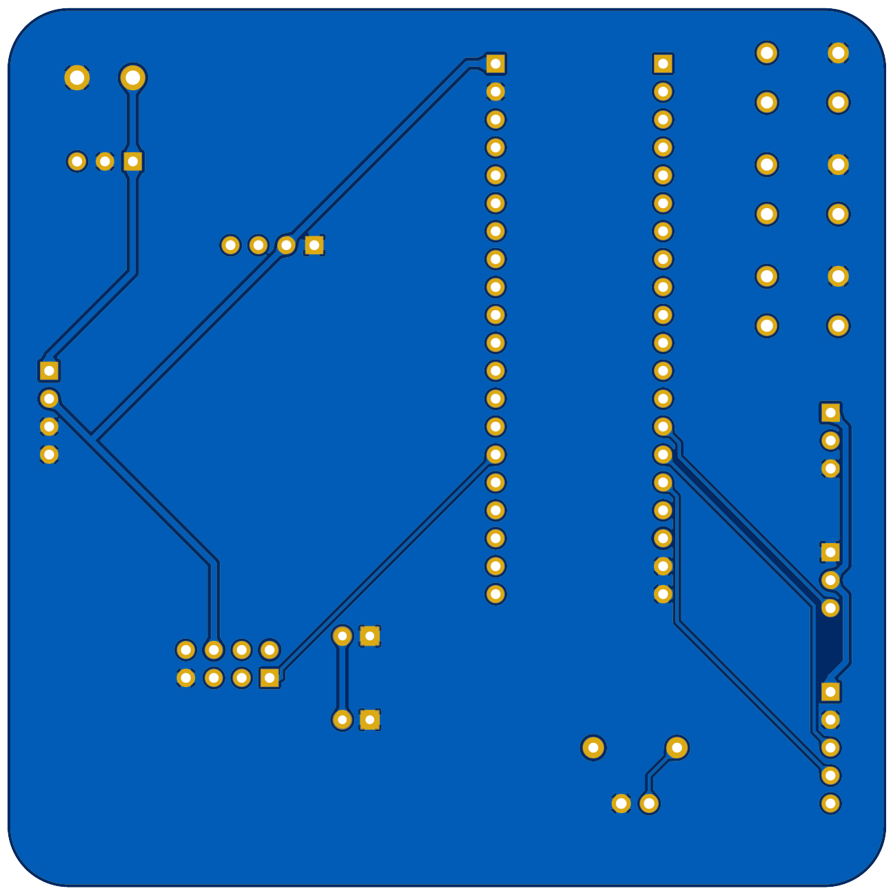
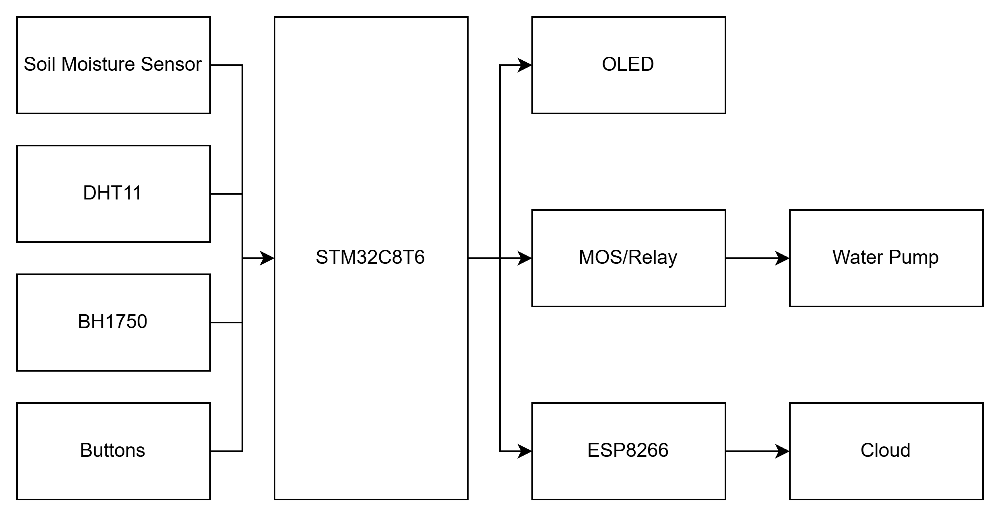
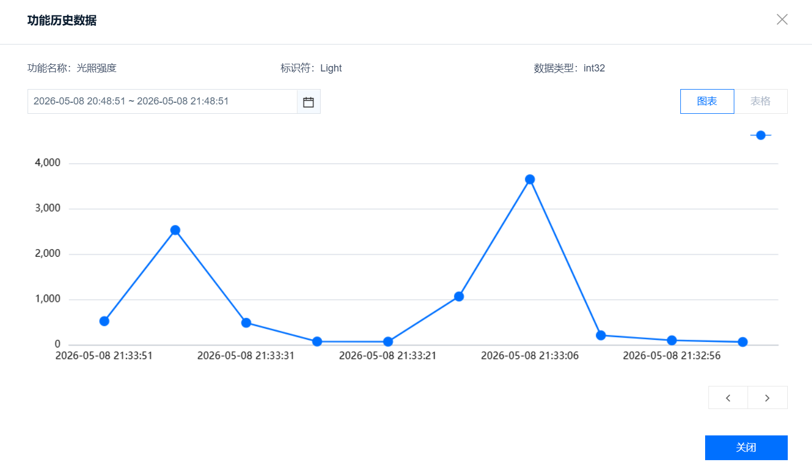

# STM32 Intelligent Agricultural Monitoring System

## Background

This repository contains my undergraduate graduation project and its subsequent improvements.

## Introduction

An intelligent agricultural monitoring system based on STM32F103C8T6, capable of environmental sensing, automatic irrigation control, and cloud data upload through MQTT.

## Features

### Environmental Monitoring

- Soil moisture measurement
- Temperature measurement
- Humidity measurement
- Light intensity measurement

### Automatic Irrigation

- Water pump control via MOS/relay
- Automatic irrigation based on soil moisture threshold

### IoT Communication

- MQTT communication through ESP8266
- Sensor data upload to cloud platform
- Remote alarm notification

## Hardware

- STM32F103C8T6
- Capacitive soil moisture sensor
- DHT11
- BH1750
- N-MOSFET
- Water pump
- ESP8266 (ESP-01S)
- OLED
- Buttons

### Hardware Prototype

### Schematic

### PCB

## Software

- C
- Keil5
- VS Code + Embedded IDE extension
- STM32 Standard Peripheral Library

## Project Structure

- Config/
- Hardware/
- Library/
- Start/
- System/
- User/

## System Structure

## Could Data Upload Example

## License

MIT License